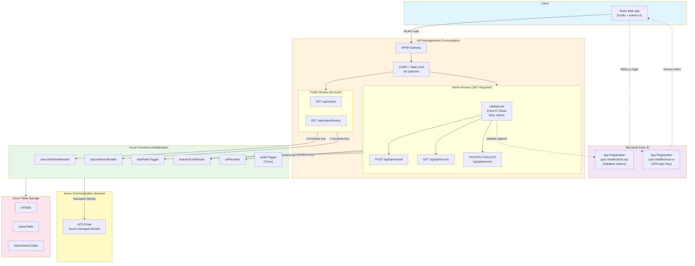

# Azure Resource Implementation Plan

## Architecture Overview

## Resources to Provision

| Resource | Resource Group | SKU/Tier | Purpose |
|----------|---------------|----------|---------|
| API Management | `rg-apim-shared` | Consumption | Shared gateway — reusable across projects |
| Azure Communication Services | `functions-cpsc1` | Free tier | Email alerts (ACS Email) |
| Entra ID App Registration | N/A (tenant-level) | N/A | OAuth2/OIDC for admin UI login |
| Static Web App | `functions-cpsc1` | Free | Host the UI (public + admin paths) |

### Resource Group Strategy

| Resource Group | Lifecycle | Contents |
|---------------|-----------|----------|
| `rg-apim-shared` | Long-lived, shared | APIM instance only — backends/APIs/policies added per project |
| `functions-cpsc1` | Project-specific | Function App, ACS, SWA, Storage |

> **Why separate?** APIM Consumption is pay-per-call with no base cost. A single instance can serve multiple projects. Isolating it means you can tear down project resource groups without losing the gateway, and add new project APIs without redeploying the gateway itself.

### Bicep File Layout

| File | Target Resource Group | Deploys |
|------|----------------------|---------|
| `infra/apim-shared.bicep` | `rg-apim-shared` | APIM instance |
| `infra/main.bicep` | `functions-cpsc1` | ACS, SWA, APIM API/operations/policies (cross-RG ref to shared APIM) |
| `infra/apim-shared.parameters.json` | — | Parameters for shared APIM |
| `infra/main.parameters.json` | — | Parameters for project resources |

---

## 1. Azure Communication Services (ACS)

- **Resource**: `acs-cpsc-email`
- **Purpose**: Send email notifications (replaces SendGrid)
- **Config**:
  - Enable Email service with Azure-managed domain
  - Sender: `donotreply@<guid>.azurecomm.net`
  - Connect ACS resource to Function App via `ACS_ENDPOINT` app setting
  - Use Managed Identity (DefaultAzureCredential) — no connection strings in production

## 2. API Management (APIM) — Shared Instance

- **Resource Group**: `rg-apim-shared` (separate from project resources)
- **Resource**: `apim-shared`
- **SKU**: Consumption (serverless, pay-per-call, no monthly base cost)
- **Reusability**: One instance serves all projects; each project adds its own API + backend + policies
- **Deployed via**: `infra/apim-shared.bicep` (run once, or idempotent on re-run)

### Health Check API (added by project Bicep)

- **Backend**: Azure Function App `healthchker`
- **APIs to expose**:

| API Route | Method | Auth Required | Backend Function |
|-----------|--------|---------------|-----------------|
| `/api/status` | GET | No (public) | statusSiteStateReader |
| `/api/status/history` | GET | No (public) | statusHistoryReader |
| `/api/admin/poll` | POST | Yes (JWT) | httpPollerTrigger |
| `/api/admin/urls` | GET | Yes (JWT) | statusUrlListReader |
| `/api/admin/urls` | POST/PUT/DELETE | Yes (JWT) | urlPersister |

- **Policies**:
  - **All operations**: CORS, rate-limit (60 calls/min per IP)
  - **Public routes** (`/api/status/*`): No auth policy
  - **Admin routes** (`/api/admin/*`): `validate-jwt` policy requiring valid Entra ID token
    - Issuer: `https://login.microsoftonline.com/{tenantId}/v2.0`
    - Audience: App Registration client ID
    - Required claims: `roles` contains `Admin`

## 3. Entra ID App Registration

### 3a. Backend API Registration (APIM validates tokens against this)

- **App Name**: `cpsc-healthcheck-api`
- **Expose an API**:
  - Application ID URI: `api://cpsc-healthcheck-api`
  - Scope: `api://cpsc-healthcheck-api/access_as_user`
- **App Roles**:
  - `Admin` — assigned to users who can access admin routes
- **Manifest settings**:
  - `accessTokenAcceptedVersion`: 2

### 3b. Frontend SPA Registration (UI uses this to get tokens)

- **App Name**: `cpsc-healthcheck-ui`
- **Platform**: Single-page application (SPA)
- **Redirect URIs**:
  - `https://<static-web-app-url>/`
  - `http://localhost:3000/` (local dev)
- **API Permissions**:
  - `api://cpsc-healthcheck-api/access_as_user` (delegated)
- **Implicit grant**: ID tokens enabled (for SPA MSAL.js)

## 4. Static Web App

- **Resource**: `swa-cpsc-healthcheck`
- **Plan**: Free
- **Custom domain**: TBD
- **Routing**:
  - `/` — public landing page (no auth)
  - `/admin/*` — protected pages (MSAL.js handles login redirect)
- **API calls**: UI calls APIM endpoint (not Function App directly)

## 5. Function App Updates

- **Managed Identity**: System-assigned, grant:
  - `Contributor` on ACS resource (for email send)
  - Or use ACS-specific RBAC role
- **App Settings to add**:
  - `ACS_ENDPOINT`: ACS resource endpoint URL
- **Remove**: Any direct public access; all traffic flows through APIM
  - Set Function App auth level to `Function` (require function key)
  - APIM passes the function key via `x-functions-key` header in named values

---

## Implementation Order

1. **APIM (shared)** — `az deployment group create -g rg-apim-shared -f infra/apim-shared.bicep` (one-time, reusable)
2. **ACS + SWA** — `az deployment group create -g functions-cpsc1 -f infra/main.bicep` (project-specific + cross-RG APIM config)
3. **Entra ID App Registrations** — create both API and SPA registrations (manual/CLI)
4. **Function App config** — enable managed identity, lock down access, set ACS_ENDPOINT
5. **APIM named value** — update `healthcheck-function-key` with actual Function App host key

---

## Security Notes

- Function App is NOT publicly callable without function key
- APIM holds the function key as a Named Value (secret)
- Admin endpoints require Entra ID JWT with `Admin` role claim
- Public endpoints still rate-limited via APIM policy
- ACS uses Managed Identity — no secrets stored
