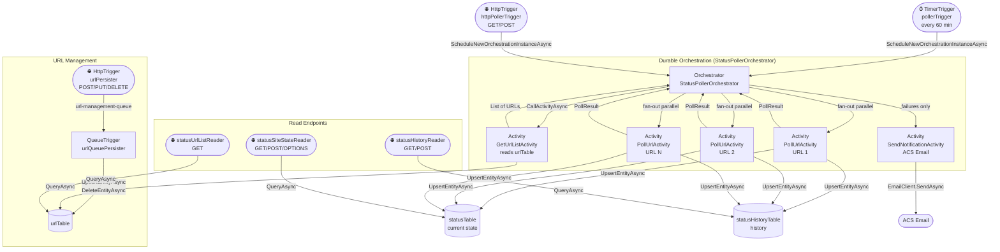

# Site Status Notification

Provides simple HTTP-polling-based monitoring for public websites or HTTP services.
Each configured URL is polled on a schedule (or on demand). If one or more sites return a non-OK status, an email alert is sent with a summary of failures and a link to the status dashboard.

## Stack

| Data Store | Messaging | Runtime | Email Delivery |
|---|---|---|---|
| [Azure Storage Tables](https://azure.microsoft.com/services/storage/tables/) | [Azure Queue Storage](https://azure.microsoft.com/services/storage/queues/) | .NET 8 Isolated Worker (Azure Functions v4) | [Azure Communication Services Email](https://azure.microsoft.com/services/communication-services/) |

---

## Architecture

---

## Function Reference

| Function | Trigger | Role |
|---|---|---|
| `pollerTrigger` | Timer (every 60 min) | Starts a poll orchestration instance |
| `httpPollerTrigger` | HTTP GET/POST | Manually starts a poll orchestration instance |
| `StatusPollerOrchestrator` | Durable Orchestrator | Fan-out/fan-in: fetches URLs, polls all in parallel, notifies on failure |
| `GetUrlListActivity` | Durable Activity | Reads `urlTable` directly — no internal HTTP call |
| `PollUrlActivity` | Durable Activity | Polls one URL; writes current state + history row; returns `PollResult` |
| `SendNotificationActivity` | Durable Activity | Sends ACS Email alert for all failing URLs |
| `urlPersister` | HTTP POST/PUT/DELETE | Accepts URL add/update/delete requests, enqueues to `url-management-queue` |
| `urlQueuePersister` | Queue (`url-management-queue`) | Persists URL changes to `urlTable` |
| `statusUrlListReader` | HTTP GET | Returns configured URL list from `urlTable` |
| `statusSiteStateReader` | HTTP GET/POST/OPTIONS | Returns current poll status from `statusTable` |
| `statusHistoryReader` | HTTP GET/POST | Returns poll history from `statusHistoryTable` |

---

## Required App Settings

| Setting | Description |
|---|---|
| `AzureWebJobsStorage` | Storage account connection string |
| `FUNCTIONS_WORKER_RUNTIME` | Must be `dotnet-isolated` |
| `EMAIL_SENDER` | ACS sender address (e.g. `donotreply@xxxxxxxx.azurecomm.net`) |
| `EMAIL_SUBJECT` | Email subject line |
| `EMAIL_RECIPIENTS` | Semicolon-separated recipient list |
| `ACS_ENDPOINT` | ACS resource URI — used with managed identity (production) |
| `ACS_CONNECTION_STRING` | ACS connection string — local dev fallback |
| `dashboard_url` | Status dashboard URL included in alert emails |

See `local.settings.json.template` for the full list. Copy it to `local.settings.json` (gitignored) and fill in values before running locally.

